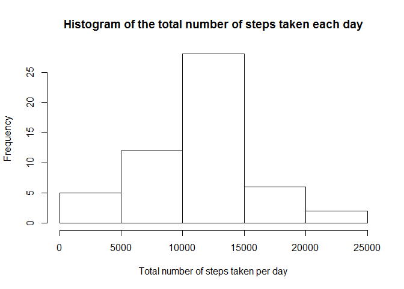
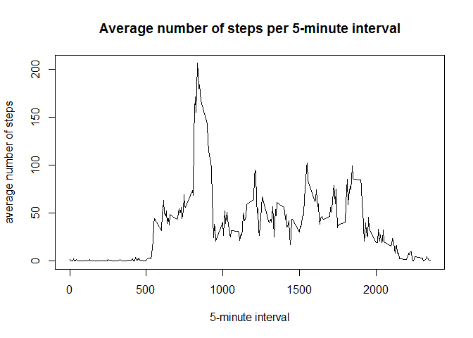
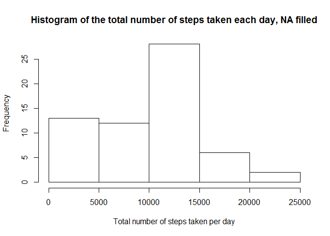
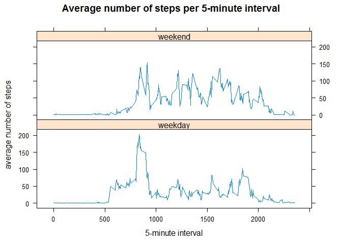

# Reproducible Research: Peer Assessment 1


## Loading and preprocessing the data


```r
Activity <- read.csv("./activity.csv")
as.Date(Activity$date)
```

## What is mean total number of steps taken per day?


```r
## 1. Histogram of total number of steps per day
StepsPerDay <-aggregate(Activity$steps, by = list(date = Activity$date), FUN=sum)
hist(StepsPerDay$x, 
     main = "Histogram of the total number of steps taken each day",
     xlab = "Total number of steps taken per day")
```

<!-- -->

```r
dev.copy(png,file = "./figure/hist1.png")
```

```
## png 
##   3
```

```r
dev.off()
```

```
## png 
##   2
```

```r
## 2. Calculate and report mean and median
mean <- mean(StepsPerDay$x, na.rm = TRUE)
median <- median(StepsPerDay$x, na.rm = TRUE)
```

The mean total number of steps per day equals 1.0766189\times 10^{4}.
The median of the total number of steps per day equals 10765.


## What is the average daily activity pattern?


```r
## Remove all NA-rows
ActivityComplete <- Activity[complete.cases(Activity),]

## Calculate average number of steps per interval
StepsPerInterval <- aggregate(ActivityComplete$steps,
                              by = list(interval = ActivityComplete$interval),
                              FUN=mean)

## 1. Time series plot
plot(StepsPerInterval$interval, StepsPerInterval$x , type = "l",
     main = "Average number of steps per 5-minute interval",
     xlab = "5-minute interval", ylab = "average number of steps")
```

<!-- -->

```r
dev.copy(png,file = "./figure/plot1.png")
```

```
## png 
##   3
```

```r
dev.off()
```

```
## png 
##   2
```

```r
## 2. 5-minute interval with maximum number of steps on average per day
StepsPerInterval <- StepsPerInterval[order(-StepsPerInterval$x),]
max <- StepsPerInterval[1,1]
```

The 5-minute interval, which contains the maximum number of steps on average across all the days is: 835 


## Imputing missing values


```r
## 1. Total number of missing values

NArows <- sum(is.na(Activity$steps))

## 3. New dataset with the missing data filled in with average 5-minute interval
ActivityNAfiled <- merge(Activity, StepsPerInterval, by.x = "interval", by.y = "interval",
                         all = TRUE)
ActivityNAfiled$steps[which(is.na(ActivityNAfiled$steps))] <- ActivityNAfiled$x
```

```
## Warning in ActivityNAfiled$steps[which(is.na(ActivityNAfiled$steps))]
## <- ActivityNAfiled$x: number of items to replace is not a multiple of
## replacement length
```

```r
## 4. Histogram of total number of steps taken per day
StepsPerDayNAfilled <-aggregate(ActivityNAfiled$steps,
                                by = list(date = ActivityNAfiled$date),
                                FUN=sum)
hist(StepsPerDayNAfilled$x, 
     main = "Histogram of the total number of steps taken each day, NA filled",
     xlab = "Total number of steps taken per day")
```

<!-- -->

```r
dev.copy(png,file = "./figure/hist2.png")
```

```
## png 
##   3
```

```r
dev.off()
```

```
## png 
##   2
```

```r
## Calculate and report mean and median
meanNAfilled <- mean(StepsPerDayNAfilled$x)
medianNAfilled <- median(StepsPerDayNAfilled$x)
```

The total number of rows with NA's is: 2304

After filling the missing data with the average number of steps per 5-minute interval, the
mean total number of steps per day equals 9371.4370554.
Moreover, the median of the total number of steps per day equals 1.0395\times 10^{4}.


It can be seen that filling the missing data in this way, decreases the mean and median of the total daily number of steps reported earlier.


## Are there differences in activity patterns between weekdays and weekends?


```r
## 1. Create factor variable with two levels -- "weekday" and "weekend"
ActivityNAfiled$Day <- weekdays(as.Date(ActivityNAfiled$date), abbreviate = "TRUE")
ActivityNAfiled$Weekend <- "weekday"
ActivityNAfiled$Weekend[which(ActivityNAfiled$Day == "Sat" | 
                              ActivityNAfiled$Day == "Sun")] <- "weekend"

StepsPerIntervalNAfilled <- aggregate(ActivityNAfiled$steps,
                                      by = list(interval = ActivityNAfiled$interval,
                                                Weekend = ActivityNAfiled$Weekend),
                                      FUN=mean)

library(lattice)
xyplot(StepsPerIntervalNAfilled$x ~ StepsPerIntervalNAfilled$interval|
                StepsPerIntervalNAfilled$Weekend,
       type = "l",
       main = "Average number of steps per 5-minute interval",
       xlab = "5-minute interval", ylab = "average number of steps",
       layout = c(1,2))
```

<!-- -->

```r
dev.copy(png,file = "./figure/plot2.png")
```

```
## png 
##   3
```

```r
dev.off()
```

```
## png 
##   2
```

